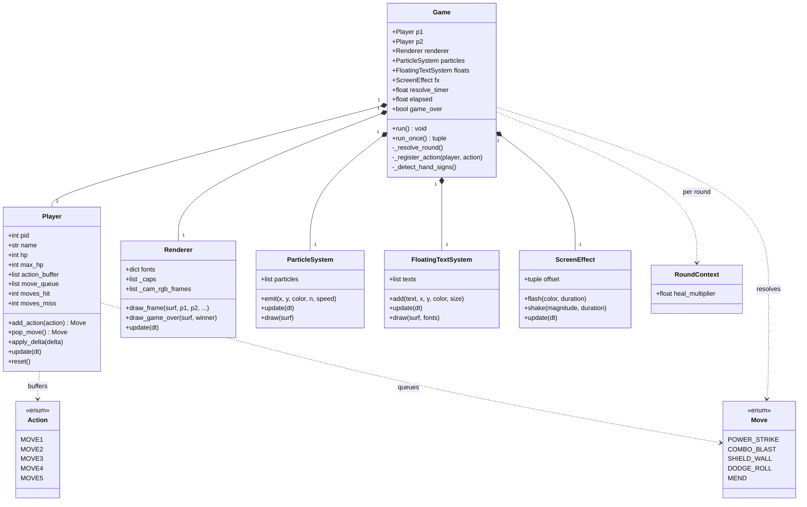
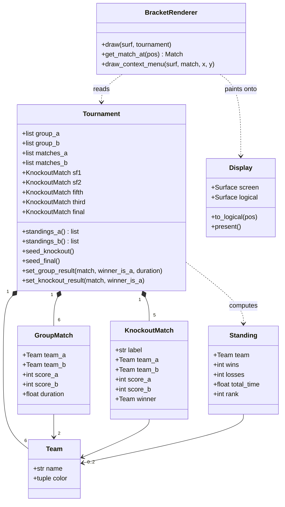
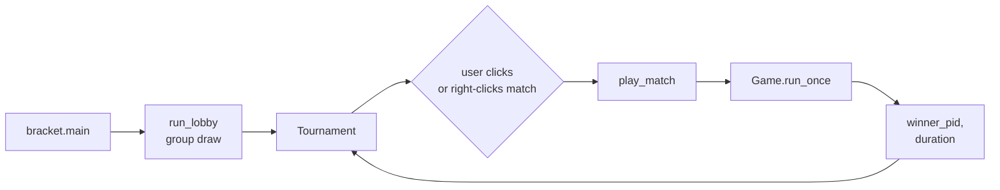

# SIGIL STRIKE — 2-Player Hand-Sign Fighter

This game was designed for the DSO's World of Science (WOS) AI computer vision workshop 2026. Two players throw hand-sign gestures at the webcam; the game reads them, queues combos, and resolves a round at regular intervals. Keyboard input is always available as a fallback.

---

## Table of contents

- [Quick start (Windows)](#quick-start-windows)
- [Release build (standalone .exe)](#release-build-standalone-exe)
  - [Packaging a release zip](#packaging-a-release-zip)
  - [Building the data-collector exe](#building-the-data-collector-exe)
- [File structure](#file-structure)
- [Architecture](#architecture)
  - [Match runtime](#match-runtime)
  - [Tournament data model](#tournament-data-model)
  - [Match dispatch flow](#match-dispatch-flow)
- [Controls](#controls)
- [Moves & combos](#moves--combos)
- [Resolution logic](#resolution-logic)
  - [Full resolution table](#full-resolution-table)
- [Hand-sign model pipeline](#hand-sign-model-pipeline)
  - [Collection controls](#collection-controls)
  - [Training on Google Colab](#training-on-google-colab)
  - [Custom CNN architectures](#custom-cnn-architectures)
- [Team configuration (`team.env`)](#team-configuration-teamenv)
- [Dependencies](#dependencies)

---

## Quick start (Windows)

Double-click `start_game.bat`, or from a terminal:

```bash
python code/main.py
```

The game launches in keyboard mode by default. If a team has trained model files under `Teams/Team<N>/models/`, the matching `inference.py` can be run alongside the game to feed hand-sign predictions over a local UDP socket.

---

## Release build (standalone .exe)

All build / packaging scripts live in the top-level [`scripts/`](scripts/) directory so they're cleanly separated from the game source under `code/`.

The whole game can be packaged into a single Windows executable via PyInstaller:

```bash
python scripts/build_game_exe.py            # full build (≈2 GB, CNN included)
python scripts/build_game_exe.py --no-cnn   # smaller build (≈300 MB, landmark-only)
python scripts/build_game_exe.py --clean    # wipe build/sigil_strike + spec first
```

Resulting `dist/sigil_strike/` layout (PyInstaller intermediates land in `build/sigil_strike/` and are gitignored):

```
dist/sigil_strike/
├── sigil_strike.exe         single-file binary (audio, images, mediapipe bundled)
├── configs/
│   ├── move_config.ini      edit to rebalance damage / defence / heal values
│   └── time_config.ini      edit to retune resolve interval, deathmatch timings
└── Teams/
    └── Team1 ... Team6/     per-team team.env, model_arch.py, models/
```

Ship the entire `dist/sigil_strike/` folder. The `.exe` reads `configs/*.ini` and `Teams/` from the directory it lives in, so end-users can rebalance the game or swap in new team models without rebuilding.

Missing INI keys or files fall back to the built-in defaults (a warning is printed). The full set of tunables and their defaults are documented in `code/configs/move_config.py` and `code/configs/time_config.py`.

### Packaging a release zip

`scripts/build_release.py` stages `dist/sigil_strike/` into a clean release folder with a player-facing `README.txt` and zips it for distribution:

```bash
python scripts/build_release.py                       # package existing dist/sigil_strike/
python scripts/build_release.py --build               # run the .exe build first
python scripts/build_release.py --build --no-cnn      # slim build + zip
python scripts/build_release.py --name sigil_strike_v1.2   # versioned filename
```

Outputs land under `release/` at the repo root:

```
release/
├── sigil_strike/            unzipped folder, ready to run
│   ├── sigil_strike.exe
│   ├── README.txt           short player-facing usage notes
│   ├── configs/
│   └── Teams/
└── sigil_strike.zip         the same folder, zipped for sharing
```

### Building the data-collector exe

`scripts/build_collect_exe.py` produces a standalone `collect_data.exe` for teammates to capture training samples without a Python install:

```bash
python scripts/build_collect_exe.py            # → dist/collect_data/collect_data.exe
python scripts/build_collect_exe.py --clean    # wipe build/collect_data + spec first
```

---

## File structure

```
World-of-Science/
├── start_game.bat              Windows launcher → runs code/main.py
├── code/
│   ├── main.py                 Entry point
│   ├── game.py                 Game loop, event handling, resolution
│   ├── moves.py                Action / Move enums, combo table, resolve logic
│   ├── player.py               Player state (HP, action buffer, queue)
│   ├── renderer.py             Pygame drawing (no game logic)
│   ├── effects.py              Particles, floating text, screen shake
│   ├── audio.py                SFX / BGM loader with per-track volume balancing
│   ├── constants.py            Colours, layout, key bindings
│   ├── camera.py               Standalone gesture predictor (legacy UDP path)
│   ├── webcam_test.py          Standalone webcam diagnostic
│   ├── bracket.py              Tournament bracket
│   ├── paths.py                resource_dir() / external_dir() — bundle vs. ext layout
│   ├── configs/                Gameplay tunables (INI + Python loaders)
│   │   ├── __init__.py
│   │   ├── move_config.ini     Editable: damage, heal, defence %, combo sequences
│   │   ├── time_config.ini     Editable: resolve interval, deathmatch timings
│   │   ├── move_config.py      Reads move_config.ini, exposes values as attributes
│   │   └── time_config.py      Reads time_config.ini, exposes values as attributes
│   ├── model/
│   │   ├── run.sh              Dispatcher → collect | train | infer
│   │   ├── sigil_strike_colab.ipynb   Colab notebook for collect / train / infer
│   │   ├── collect_data.py     Unified collector launcher (CNN or landmark)
│   │   ├── landmark/           MediaPipe landmarks → sklearn classifier
│   │   │   ├── collect_data.py
│   │   │   ├── train_model.py
│   │   │   ├── inference.py
│   │   │   ├── hand_landmarker.task
│   │   │   └── requirements.txt
│   │   └── cnn/                MobileNetV2 transfer learning
│   │       ├── collect_data.py
│   │       ├── train_model.py
│   │       ├── inference.py
│   │       ├── gpu.py
│   │       └── requirements.txt
│   └── test-cases/
│       ├── conftest.py
│       ├── test_moves.py
│       ├── test_player.py
│       └── test_tournament.py
├── scripts/                    Build & packaging scripts (kept separate from game code)
│   ├── build_game_exe.py       PyInstaller build → dist/sigil_strike/sigil_strike.exe
│   ├── build_release.py        Stages dist/sigil_strike/ + README into release/sigil_strike.zip
│   └── build_collect_exe.py    PyInstaller build → dist/collect_data/collect_data.exe
├── Teams/                      Per-team configs + trained weights
│   ├── Team1/
│   │   ├── team.env            NAME, COLOR, MODEL_TYPE, thresholds
│   │   ├── model_arch.py       (CNN only, optional) custom architecture
│   │   └── models/             Trained checkpoint(s)
│   └── Team2 ... Team6/
├── audio/
│   ├── sfx/                    Sound effects (loudness-equalised at load time)
│   └── bgm/                    Background music (stage-specific tracks)
└── images/                     Action icons
```

> **Note:** `audio/bgm/` tracks are omitted from the repository due to possible copyright issues, and the per-team model weights under `Teams/Team<N>/` are excluded due to their file size. Both are listed above for completeness — drop the files in at the indicated paths locally.

---

## Architecture

There are two top-level object graphs: the **match runtime** (everything spawned by `Game`) and the **tournament data model** (everything in `bracket.py`). They connect at one point — `bracket.play_match()` constructs a `Game` and waits on `Game.run_once()` for a winner.

### Match runtime



Key invariants:
* `Renderer` only reads game state, never mutates it (drawing is a pure projection).
* `Player` knows nothing about pygame or the renderer — it's pure game logic.
* The free function `moves.resolve_moves(m1, m2, ctx)` is the only place HP deltas are computed.

### Tournament data model



### Match dispatch flow



Each `play_match` call constructs a fresh `Game`, blocks until it resolves, then writes the result back into the `Tournament` — which triggers `_reseed()` for any knockout slots that depend on the changed standings.

---

## Controls

| P1 key | P2 key | Action |
|--------|--------|--------|
| Q      | Y      | Move1  |
| W      | U      | Move2  |
| E      | I      | Move3  |
| R      | O      | Move4  |
| T      | P      | Move5  |

Same five actions are also fed in by the hand-sign pipeline when active.

---

## Moves & combos

| Move          | Combo                       | Type      | Effect                                                       |
|---------------|-----------------------------|-----------|--------------------------------------------------------------|
| Power Strike  | Any 3 identical *           | Offensive | −25 HP to opponent                                           |
| Combo Blast   | Move1 → Move2 → Move3       | Offensive | −45 HP to opponent                                           |
| Shield Wall   | Move3 → Move4 → Move5       | Defensive | Fully blocks Power Strike (reflects 30 %); leaks 20 % of Combo Blast |
| Dodge Roll    | Move1 → Move3 → Move5       | Defensive | 70 % chance to dodge Power Strike; 33 % chance vs Combo Blast |
| Mend          | Any X → Y → X   (X ≠ Y)     | Healing   | +35 HP (cancelled by opponent's attack)                      |

\* Move1×3, Move2×3, Move3×3, Move4×3, or Move5×3 — any three identical actions in a row.

The combo matcher checks the explicit sequences (Combo Blast, Shield Wall, Dodge Roll) before Power Strike's `X-X-X` catch-all and Mend's `X-Y-X` pattern. The sequences are chosen so no two combos collide.

---

## Resolution logic

Every 5 seconds one move is popped from each player's queue and resolved:

1. Healing (Mend) is applied **only if the opponent did not play an attack**.
   A Power Strike or Combo Blast from the opponent fully cancels the heal.
2. Raw attack and heal values are rolled (base value ±5 each round).
3. Defences reduce incoming damage:
   * **Shield Wall**
     * vs Power Strike → fully blocks AND reflects 30 % back at attacker
     * vs Combo Blast  → 20 % of damage leaks through
     * vs anything else → no effect
   * **Dodge Roll**
     * vs Power Strike → 70 % chance to fully dodge, else full damage
     * vs Combo Blast  → 33 % chance to fully dodge, else full damage
     * vs anything else → no effect
4. Net HP deltas are applied simultaneously.

### Full resolution table

Base values: Power Strike 25 HP, Combo Blast 45 HP, Mend +35 HP (all ±5 variance per round).
Rows are unordered pairings — swap P1 ↔ P2 for the mirror outcome.

| P1 move       | P2 move       | Result                                                |
|---------------|---------------|-------------------------------------------------------|
| Power Strike  | Power Strike  | Both −25 HP                                           |
| Power Strike  | Combo Blast   | P1 −45 HP, P2 −25 HP                                  |
| Power Strike  | Shield Wall   | P1 −7 HP (reflect); P2 unchanged                      |
| Power Strike  | Dodge Roll    | 70 % chance P2 dodges (0 dmg); else P2 −25 HP         |
| Power Strike  | Mend          | P2 heal cancelled, takes −25 HP                       |
| Power Strike  | (idle)        | P2 −25 HP                                             |
| Combo Blast   | Combo Blast   | Both −45 HP                                           |
| Combo Blast   | Shield Wall   | P2 −9 HP (20 % leaks through); P1 unchanged           |
| Combo Blast   | Dodge Roll    | 33 % chance P2 dodges (0 dmg); else P2 −45 HP         |
| Combo Blast   | Mend          | P2 heal cancelled, takes −45 HP                       |
| Combo Blast   | (idle)        | P2 −45 HP                                             |
| Shield Wall   | Shield Wall   | No effect                                             |
| Shield Wall   | Dodge Roll    | No effect                                             |
| Shield Wall   | Mend          | P2 +35 HP; P1 unchanged                               |
| Shield Wall   | (idle)        | No effect                                             |
| Dodge Roll    | Dodge Roll    | No effect                                             |
| Dodge Roll    | Mend          | P2 +35 HP; P1 unchanged                               |
| Dodge Roll    | (idle)        | No effect                                             |
| Mend          | Mend          | Both +35 HP                                           |
| Mend          | (idle)        | P1 +35 HP                                             |
| (idle)        | (idle)        | No effect                                             |

---

## Hand-sign model pipeline

Each team trains its own gesture recogniser for `move1`…`move5`. Two pipelines are supported — pick one per team in `Teams/Team<N>/team.env` via `MODEL_TYPE`:

| Pipeline   | What it does                                                                                                              | When to pick                                              |
|------------|---------------------------------------------------------------------------------------------------------------------------|-----------------------------------------------------------|
| `landmark` | MediaPipe extracts 21 (x, y, z) keypoints per hand → sklearn RandomForest / MLP on a 126-d feature vector                 | Fastest on CPU; tiny dataset works; default for new teams |
| `cnn`      | Raw 224×224 two-hand frames → fine-tuned MobileNetV2 → softmax over the 5 classes                                          | Better at gestures that the joint positions can't disambiguate (e.g. front/back of palm) |

### Collection controls

Use the prebuilt `collect_data.exe` to capture training samples — it bundles Python, OpenCV, MediaPipe, and the unified collector into a single 64-bit Windows binary (build it via `python scripts/build_collect_exe.py`; the output lands at `dist/collect_data/collect_data.exe`). Training data from the executable is written to a `teams/` folder.

Run with no args for an interactive prompt, or pass flags:

```
collect_data.exe                                # interactive — pick mode + team
collect_data.exe --mode cnn --team 1
collect_data.exe --mode landmark --team 3 --cam 0
```

In the camera window:

| Key   | Action                              |
|-------|-------------------------------------|
| 1–5   | Start recording for `move<N>`       |
| SPACE | Stop recording                      |
| Q     | Quit and save                       |

Landmark mode requires **both hands visible** to record a sample; CNN mode records every frame.

Once you have enough samples, zip the resulting `teams/Team<N>/` folder and upload it in **Step 3 of the Colab notebook** (the "upload an existing dataset zip (recommended)" path described below) to skip the slow webcam-bridge capture.

### Training on Google Colab

If you don't want to train locally (especially CNN, which benefits from a GPU), open `code/model/sigil_strike_colab.ipynb` in [Colab](https://colab.research.google.com/). The notebook walks through:

1. **Setup** — installs deps, picks `TEAM_NUM` + `MODEL_TYPE`, checks for GPU.
2. **Hyperparameters** — separate cells for the CNN and landmark knobs, with comments explaining each.
3. **Data collection** — either upload an existing dataset zip (recommended) or capture frames via Colab's webcam bridge.
4. **Training** — fine-tunes MobileNetV2 (CNN) or fits a RandomForest / MLP (landmark) with full plain-English explanations and short MCQs.
5. **Inference** — sanity-check predictions on uploaded images or webcam snapshots.
6. **Download** — bundles weights (and for CNN, a `model_arch.py`) into a zip that downloads to your PC's Downloads folder.

Unzip the bundle directly into `Teams/Team<N>/` and the local game picks it up automatically.

### Custom CNN architectures

For the CNN pipeline, teams can ship their own `model_arch.py` (the Colab notebook generates one automatically capturing your `CNN_HIDDEN_DIM`, `CNN_DROPOUT_1`, `CNN_DROPOUT_2`). If `Teams/Team<N>/model_arch.py` exists, both `cnn/inference.py` and `cnn/train_model.py` import its `build_model()` and use it instead of the hard-coded default — so you can change the head architecture without touching the game's code.

```
Teams/Team<N>/
├── team.env              Team config (name, colour, MODEL_TYPE, thresholds)
├── model_arch.py         (CNN only, optional) custom build_model()
└── models/
    └── hand_sign_cnn.pth        (or hand_sign_classifier.pkl + label_encoder.pkl)
```

If `model_arch.py` is absent, the default architecture is used — so existing teams' models keep working untouched.

---

## Team configuration (`team.env`)

```
NAME=ALPHA
COLOR=255,120,60

# landmark | cnn
MODEL_TYPE=landmark

# Confidence floors below which a prediction is ignored (0.0–1.0)
THRESHOLD_MOVE1=0.6
THRESHOLD_MOVE2=0.6
THRESHOLD_MOVE3=0.6
THRESHOLD_MOVE4=0.6
THRESHOLD_MOVE5=0.6
```

`MODEL_TYPE` is honoured by both training (`run.sh auto`) and the in-game runtime — when the game launches it reads each player's `team.env` and loads the matching artefacts: `hand_sign_classifier.pkl` + `label_encoder.pkl` for `landmark`, or `hand_sign_cnn.pth` (+ optional `model_arch.py`) for `cnn`. The two players can use different `MODEL_TYPE`s in the same match. CNN mode requires `torch` and `torchvision` to be installed locally.

---

## Dependencies

Game runtime:

```bash
pip install pygame
```

Landmark pipeline:

```bash
pip install -r code/model/landmark/requirements.txt
# mediapipe, opencv-python, numpy, scikit-learn, joblib
```

CNN pipeline:

```bash
pip install -r code/model/cnn/requirements.txt
# torch, torchvision, opencv-python, numpy, pillow
```
